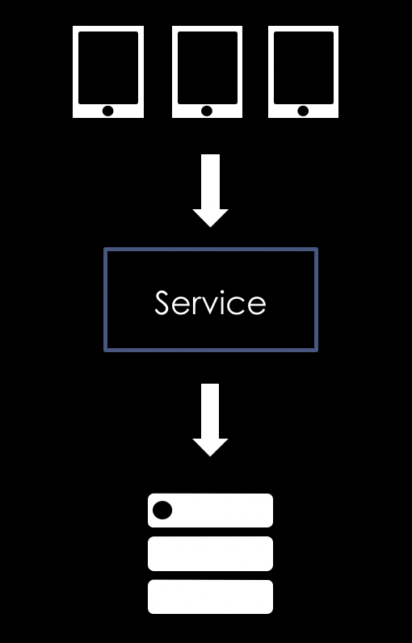
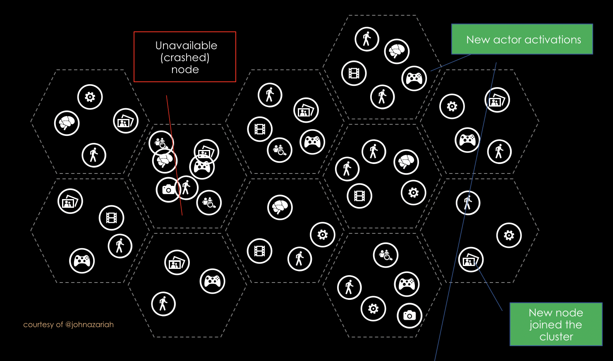

- title : Orleankka F# intro
- description : Intro to statefull distributed systems via Orleankka/Orleans
- author : Alexander Prooks
- theme : night
- transition : default

***

## Orleankka + F# 

<br />
<br />

### Stateful distributed architecture via MSFT Orleans

<br />
<br />
Alexander Prooks - [@aprooks](http://www.twitter.com/aprooks)

***

## Stateless



---

### Pros

<br/>

* Easy?
* Scalable? application servers

<br/>
<br/>

### Cons

<br/>

* State = database
* Complixity via Queues, BUSes etc. => latency
* Cache invalidation
* External scheduling:
    * lock user if it was not activated for 24 hours?

---

### Objects in memory?

* Concurrency (locks, mutexes etc.)
* Object location
* System Resilience
* Memory management

=> Don't do it! 

***

# Actor model

* Function or object
* Isolated state
* Syncronous execution
* Messages (requests) are queued in-memory

---


---

## Implementations

* Erlang ( Since 1986! )
* Akka: Jvm and .Net
* Orleans: .Net and Orbit Jvm
* ProtoActors: Go, .Net (cross platform)

---

### Akka/Erlang

``` C#
var game = activate(“game-1”, “tcp://10.0.0.1/”)
game.invoke(“foo()”) 
```

### Orleans

``` C#
var game = getGrainReference(“game-1”)
game.invoke(“foo()”) 
```
---




---
## Orleans vs others

* Virtual actors = grains
* At-least-once delivery by default
* Caller awaits remote execution

* Runtime manages pain points:

    * Clustering and availability
    * Grain distribution
    * GC inactive grains
    * Distributed transactions (Beta)
<br />
<br />

### Simplicity => Profit!

***

## Programming model

    [lang=c#]
    public interface IPinger{
        Task<Pong> Ping();
    }

    public class Pinger: Grain, IPinger
    {
        public Task<Pong> Ping(){
            return Task.FromResult("Pong");
        }
    }

---

## Orleankka function interface

    [lang=c#]
    [Serializable]
    public class Ping : ActorMessage<Pinger>
    {        
    }

    public class Pinger: Actor{
        public Task<string> Handle(Ping request){
            return Task.FromResult("Pong");
        }
    }

---

## Calling another actor

    [lang=c#]
    var pinger = System.ActorOf<Pinger>("someId");
    await pinger.Tell(new Ping());

***

### Orleans + F# = 

    module Pingers =
        type Message = 
        | Ping of string
        
        type IPinger = 
            inherit IActorGrain<Message>

        type Pinger() = 
            inherit Actor()

            interface IPinger 
            override this.Receive message = task {
                match message with
                | :? Message msg -> 
                    match msg with
                    | Ping name-> 
                        return some("Hello " + name)
            }
---

### Calling grains

    let job() = task {
        let pinger =  ActorSystem.actorOf<Pinger>(actorSystem,"myId")
        let! res = pinger <? Ping ("Alex")
        printfn "%s" res // Hello Alex
    } 

    Task.run (job)
    |> ignore

***

## Core components

```
OnReceive  ->    Handle all
Activate   ->    load  state
Reminder   ->    Persistent scheduling
Timers     ->    Recurring operations 
Streams    ->    Pub/Sub
Reentrancy ->    Concurrent execution (Queries!)
Workers    ->    Stateless parallelism 
```

***

# DEMO


***

# Marketing

* Halo with 14 ml users <br>
    * "25 servers with 90% utilization without any instability"
    * linear scaleability

    https://www.infoq.com/presentations/halo-4-orleans

* EA implemented Orbit in JVM

* Stuff I did:
    * License and usage tracking + finance
    * Property management system
    * Utility services
***

### Weapping up

* F# is awesome DDD oriented language
* Orleans is awesome platform

* F# + Orleannkka =>
    * safety 
    * development speed

***

### Thank you!